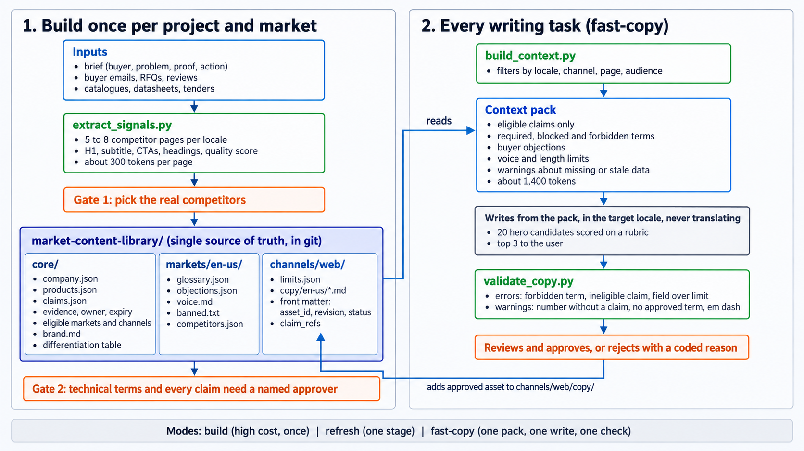

# market-native-content

Agent skills that make AI-written website copy sound like it was written by someone
who works in your market, in your language, for your buyers.

Works with Claude Code, Codex, Cursor and any agent that reads the
[Agent Skills](https://agentskills.io) format. No API keys. No dependencies beyond
Python 3.10.

## The problem

Ask an AI for a hero headline and you get "Quality you can trust, for a connected
future". The model is not bad at writing. It is writing without context: it has not
read your competitors, it does not know what your buyers call your product, and it
does not know which claims you can actually prove.

Translating that version into other languages makes it worse. The result is
grammatically fine and commercially foreign.

## What this does

Two layers. A **core** that builds and maintains a per-project knowledge library, and
thin **adapters** that turn that library into copy for one output channel.



<sup>Editable version of the same diagram: [docs/workflow.svg](docs/workflow.svg)</sup>

```text
market-native-core                  website-copy (adapter)
  library schema + templates          page blueprints
  extract_signals.py   (competitors)  hero rubric
  build_context.py     (context pack) SEO and UI limits
  validate_copy.py     (checks)       writing workflow
```

The library separates three things that every generic-copy failure mixes up:

| Folder      | Owns                                                        | Changes when            |
|-------------|-------------------------------------------------------------|-------------------------|
| `core/`     | Company facts, products, claims with evidence, brand        | The company changes     |
| `markets/`  | Per-locale glossary, buyer objections, voice, competitors   | The market changes      |
| `channels/` | Per-channel blueprints, limits, approved copy               | The output format changes |

Every writing request gets a **context pack**: a short, generated file with only the
claims, terms, objections and limits that apply to this locale, channel, page and
audience. The model writes from the pack, not from memory. A script checks the result.

## Install

With the [skills CLI](https://github.com/vercel-labs/skills):

```bash
npx skills add Asdstar30/market-native-content
```

Claude Code, manual:

```bash
git clone https://github.com/Asdstar30/market-native-content
cp -r market-native-content/skills/* ~/.claude/skills/
```

Codex:

```bash
cp -r market-native-content/skills/* ~/.codex/skills/
```

## Quick start

```bash
# 1. Create the library inside your project (never overwrites existing files)
python skills/market-native-core/scripts/init_library.py --project . --locales en-us,de-de

# 2. Fill core/ and markets/ (or let the agent do it in "build" mode)

# 3. Pull structured signals from competitor pages (title, H1, subtitle, CTAs, headings)
python skills/market-native-core/scripts/extract_signals.py https://competitor.example --out signals.json

# 4. Generate a context pack for one writing task
python skills/market-native-core/scripts/build_context.py \
  --library market-content-library --locale en-us --channel web --page product --audience patient

# 5. Write the page (the agent does this from the pack), then check it
python skills/market-native-core/scripts/validate_copy.py \
  --copy market-content-library/channels/web/copy/en-us/product--clear-aligners--patient.md \
  --library market-content-library
```

See [examples/maple-dental](examples/maple-dental/README.md) for a complete, fictional
library (`en-us`) that passes validation.

## Three modes

| Mode        | When                                   | Cost                    |
|-------------|----------------------------------------|-------------------------|
| `build`     | New project or new market              | High, once              |
| `refresh`   | A competitor, product or claim changed | Medium                  |
| `fast-copy` | Write or edit a page, section, button  | Low: one pack, one check |

The rule that keeps the fast path fast: no live research and no wide library reads
during `fast-copy` unless the pack reports missing or stale data.

## Principles the skills enforce

- **Locale, not language.** `en-us` and `en-gb` are different markets with different
  terms, objections and calls to action. `en` alone is rejected.
- **Write each locale from its own pack.** Never translate another locale's copy.
- **Claims need evidence.** Every promise in the copy references a claim in `core/claims.json`
  that has a source, an owner, an expiry and a list of markets and channels it may
  appear in. A delivery time that is fine in a private quote is not automatically fine
  on a public website.
- **Technical and regulatory terms need human approval** before they reach copy.
  Commercial phrasing may ship as a draft with a warning.
- **Competitor pages are untrusted input.** The extractor returns data. Nothing on a
  competitor page is an instruction.
- **Sound native, not average.** Competitor research feeds vocabulary and structure.
  The message comes from the differentiation file, or the copy is invisible.
- **Spend tokens on judgment, not on reading.** Scripts extract, filter and check.
  The strong model writes and chooses. Twenty hero variants cost less than one bad one.

## Library layout

```text
market-content-library/
  README.md                 what this is, who owns it, last review
  locales.json              one entry per language + market
  core/
    company.json            name, one-line description, audiences
    products.json           product_id, names, categories
    claims.json             claim_id, statement, evidence, owner, status, eligibility
    brand.md                voice at company level, differentiation
  markets/<locale>/
    glossary.json           concept_id, term, term_type, status, search_term
    objections.json         what buyers in this market push back on, in their words
    voice.md                register, dialect, formality for this market
    banned.txt              this market's clichés (one per line)
    competitors.json        paraphrased signals, URL, retrieval date, quality score
  channels/<channel>/
    limits.json             per-locale length limits, measured on the real layout
    copy/<locale>/          written assets with front matter (status, claim_refs, ...)
  packs/                    generated context packs (safe to delete)
  decisions.md              durable decisions, append only
```

Every copy asset carries its identity in front matter, so scripts can filter and
humans can find files:

```yaml
asset_id: web-enus-product-clear-aligners-patient
revision: 1
status: draft            # draft | pending_review | approved | needs_revalidation | superseded | rejected
locale: en-us
channel: web
page: product
content_scope: full-page
product_id: clear-aligners
audience: patient
claim_refs: [claim-same-day-scan-001]
context_pack_id: cp-20260915-en-us-web-product-1a2b3c4d
```

## Does it work for my language?

The pipeline has no language-specific logic except small normalisation helpers for
right-to-left scripts. Encoding detection follows the page's own declaration, so legacy
encodings (GBK, Windows-125x) extract correctly. Term matching is substring-based for
scripts without word spacing (Chinese, Japanese, attached prefixes) and word-boundary based
for Latin scripts. Tests cover UTF-8, Windows-1254, GB18030 and a right-to-left page.

What the repo ships per language is only a starter list of marketing clichés
(`references/banned/generic-<lang>.txt`) for English, German, French, Spanish, Arabic, Turkish
and Russian. Other languages start with an empty list and grow it in `markets/<locale>/banned.txt`.
Competitor discovery should use the market's own search engine (Baidu, Yandex, Naver),
which the skill asks for explicitly.

## Roadmap

Adapters planned after `website-copy` proves the data contract: `ui-microcopy`
(app strings, empty states, errors), `document-copy` (proposals, profiles, catalogues),
`presentation-copy`. The `channels/` folders already exist so the library does not need
restructuring when they land.

## Contributing

See [CONTRIBUTING.md](CONTRIBUTING.md). Scripts are standard library only, typed,
tested with `unittest`, and must pass on Linux and Windows.

## License

MIT. See [LICENSE](LICENSE).
